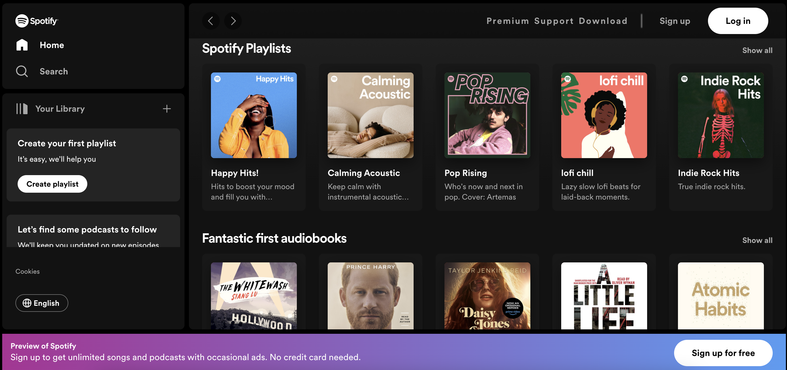
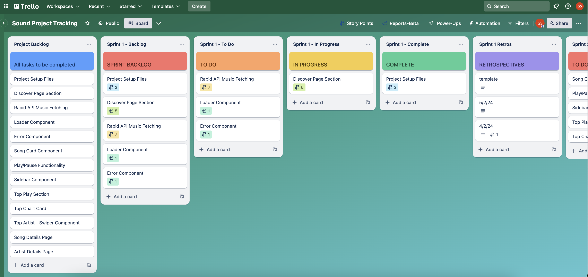

# Sound

## Project Overview

This repository contains a clone of the [Spotify](https://open.spotify.com/) Web Player functionality using React. Development languages used include JavaScript, CSS and HTML.

The aim of this project is to explore React frontend development, use open-source API libraries and develop design thinking skills.

## Project Management

The project planning and management process is tracked via Trello.
Project requirements were reviewed and broken down into tasks, as seen in the Project Backlog list.
Development of the project was broken down into 3 Sprints.
Each Sprint has its' own backlog, and once development starts the tasks are moved into the To Do, In Progress and Complete lists respectively.
Each Sprint will also has a Retrospective list in order to track any issues I came across during development. These are structured using the Rose, Bud, Thorn framework.

View the current project progress on the public Trello board [here](https://trello.com/b/eCi07Jio/sound-project-tracking).

## Project Result

TBC

## Resources Used

- [Tutorial](https://www.youtube.com/watch?v=I1cpb0tYV74)
- [node install](https://nodejs.org/en/download/)
